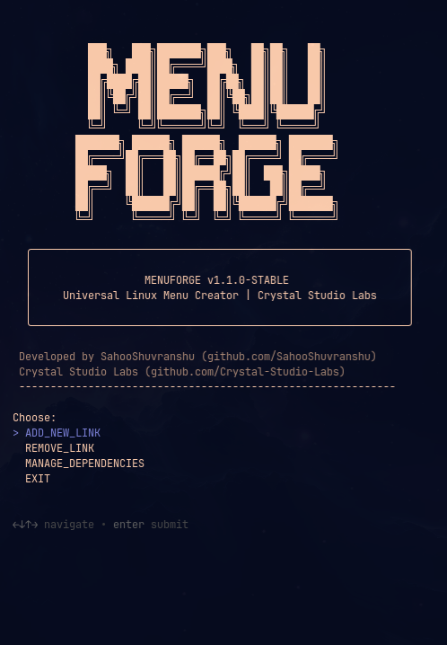

<div align="center">


# MenuForge


<br>

**The universal Desktop Entry generator and management system for Linux.**

*Bridging the gap between raw binaries and a polished desktop environment.*

<br>


<br>

[](https://github.com/SahooShuvranshu)
[](https://github.com/Crystal-Studio-Labs)

[](https://discord.gg/EdbUJHNv9J)

<br>

[Overview](#-overview) • [Preview](#-preview) • [Features](#-features) • [Installation](#-installation) • [Usage](#-usage) • [Support](#-support)

</div>

<br>

---

<br>

## 🚀 Overview

**MenuForge** is a professional-grade TUI utility designed to provide a seamless bridge between manually installed software and the modern Linux desktop environment. 

Whether you are integrating standalone binaries, custom developer scripts, or high-end games, MenuForge ensures your software is indexed, optimized, and ready for action. It eliminates the friction of manual `.desktop` file creation while injecting powerful performance hooks.

<br>

## 📸 Preview

<div align="center">
  
  <p><i>The sleek, interactive MenuForge TUI in action.</i></p>
</div>

<br>

---

<br>

## ✨ Features

### 🛠️ Professional Management System
*   **Safe Add/Remove:** Dedicated interface to manage user-created shortcuts without touching system files.
*   **Isolated Metadata:** Uses custom `X-Created-By=MenuForge` tags for non-destructive management.
*   **Dependency Manager:** Built-in tool to verify and install GameMode, MangoHud, Gamescope, and Wine.

<br>

### 🎮 Gaming & Power-User Optimizations
*   **Performance Injection:** One-click integration for `gamemoderun` to boost CPU/GPU priority.
*   **NVIDIA Prime Support:** Integrated `prime-run` toggle for dual-graphics laptops.
*   **Hardware Telemetry:** Real-time FPS and system monitoring via `mangohud`.
*   **Resolution Layering:** Micro-compositor control via `gamescope` (Native, 720p, 800x600).
*   **Wine Intelligence:** Automatic detection and wrapping for Windows `.exe` files.

<br>

### 🎨 Native Aesthetics & UX
*   **Forging Animations:** Premium terminal animations (Hammer/Pulse) for a high-end feel.
*   **Theme Sync:** Automatically synchronizes TUI colors with your active system theme.
*   **Professional TUI:** Beautiful, spacious design built with the `gum` framework.
*   **Instant Menu Indexing:** Automatically refreshes launchers (Walker, Rofi, Wofi) upon deployment.

<br>

---

<br>

### 🛠️ Tech Stack & Ecosystem

<div align="center">


</div>

<br>

---

<br>

## 📦 Installation

To deploy **MenuForge** on your Linux system, execute the interactive installer:

```bash
# Clone the repository
git clone https://github.com/Crystal-Studio-Labs/MenuForge.git
cd MenuForge

# Run the professional installer
chmod +x install.sh
./install.sh
```

<br>

---

<br>

## ⌨️ Usage

Launch the management console from your terminal or application menu:

```bash
menuforge
```

<br>

---

<br>

## 📊 Analytics & Community

### 🌟 Star History
[](https://star-history.com/#Crystal-Studio-Labs/MenuForge&Date)

<br>

### 🤝 Community
[](https://discord.gg/EdbUJHNv9J)

<br>

### 🤝 Contributors
<a href="https://github.com/Crystal-Studio-Labs/MenuForge/graphs/contributors">
  
</a>

<br>

---

<br>

## 🏢 Credits & Contact

*   **Lead Developer:** [SahooShuvranshu](https://github.com/SahooShuvranshu)
*   **Organization:** [Crystal Studio Labs](https://github.com/Crystal-Studio-Labs)
*   **Contact:** [connect.crystalstudio@gmail.com](mailto:connect.crystalstudio@gmail.com)

<br>

---

<br>

## ⚖️ Community & Governance

*   **[Contributing](CONTRIBUTING.md):** Join us in building the universal bridge.
*   **[Code of Conduct](CODE_OF_CONDUCT.md):** Standard for a welcoming community.
*   **[Security Policy](SECURITY.md):** Report vulnerabilities securely.
*   **[Support](SUPPORT.md):** Get help from the community.

<br>

---

<br>

## 📄 License

This project is licensed under the **MIT License**. See the [LICENSE](LICENSE) file for the full text.

<br>

---

<br>

<div align="center">

| Issues | Stars | Forks | Last Commit |
| :---: | :---: | :---: | :---: |
| [](https://github.com/Crystal-Studio-Labs/MenuForge/issues) | [](https://github.com/Crystal-Studio-Labs/MenuForge/stargazers) | [](https://github.com/Crystal-Studio-Labs/MenuForge/network/members) | [](https://github.com/Crystal-Studio-Labs/MenuForge/commits/main) |

<br>

Developed with ❤️ and ☕ by **[SahooShuvranshu](https://github.com/SahooShuvranshu)** & **[Crystal Studio Labs](https://github.com/Crystal-Studio-Labs)**

</div>
